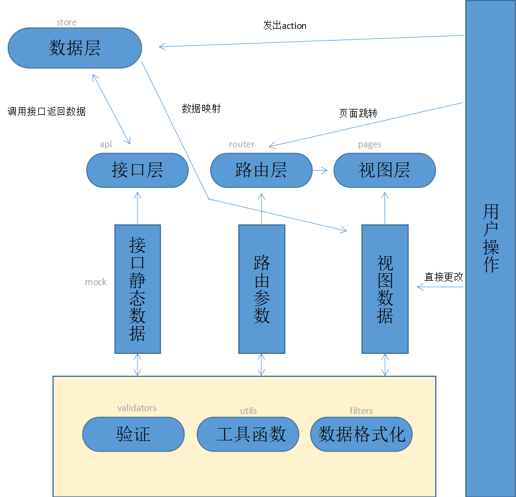

### 目录简介
项目结构分层



项目目录结构
```JS
RootDir
|- build (编译工具类js)
|- bin (可执行工具)
|- config (配置类js)
|- dist (编译后js，用于发布生产的文件)
|- docs (文档所在文件夹)
|- node_modules (工程所依赖模块的文件夹)
|- src (工程源文件)
   |- api (接口层)
   |- assets (静态资源)
   |- components (vue组件文件夹)
   |- filters (数据格式化)
   |- mock (静态数据)
   |- pages (视图层)
   |- router (路由层)
   |- store (数据层)
   |- titcomponents (自主开发的公用vue组件文件夹)
   |- utils (工具)
   |- validators (数据验证)
   |- App.vue (项目入口组件)
   |- main.js (项目入口js)
   |- variable.scss (css变量文件)
|- test (工程测试文件)
|- .babelrc (babel编译配置文件)
|- .postcssrc.js (postcss配置文件)
|- package.json (package文件)
```

### 创建一个增删改查模块
+ 设计模块内容：查询，列表，删除在一个查询页面中完成，编辑新增在一个详情页面中完成
+ 在`src/router/modules/` 下创建路由文件，内容如下

```JS
const _import = require('../_import_' + process.env.NODE_ENV)
const HomeHeaderVue = _import('components/homeheader')
// 查询/删除的页面对应的组件
const OrderQuery = _import('components/orderQuery')
// 新增/编辑的页面对应的组件
const Order = _import('components/order')

export const orderList = {
  path: '/orderList',
  components: {
    header: HomeHeaderVue, // 引用的header组件
    main: OrderQuery // 引用的页面组件，如果有侧边导航则加入aside节点
  }
}

export const orderRouter = {
  path: '/orderAdd',
  components: {
    header: HomeHeaderVue,
    main: Order
  }
}

export const orderUpdate = {
  path: '/order/:id',
  components: {
    header: HomeHeaderVue,
    main: Order
  },
  props: {
    header: false,
    main: true
  }
}


```

+ 通过命令行创建组件

``` bash
node .\bin\initComponent -c orderQuery
node .\bin\initComponent -c order
```

+ 打开`orderQuery.vue`设计视图数据

```JS
  data () {
    return {
      condition: {},
      conditionValidate: []
    }
  }
```

+ 设计数据，在`store`文件夹中定义store的数据视图

```JS
import { addOrder, delOrder, updateOrder, qeuryOrder } from '@/api/order'
export const order = {
  state: {
    orders: []
  },
  getters: {
    getOrderById: (state) => (id) => {
      return Object.assign(state.orders.find(order => order.id === id))
    }
  },
  mutations: {
    ADD (state, order) {
      if (!order.id) {
        order.id = state.orders.length + 1
      }
      state.orders.push(order)
    },
    DEL (state, id) {
      const index = state.orders.findIndex(order => order.id === id)
      if (index !== -1) {
        state.orders.splice(index, 1)
      }
    },
    UPDATE (state, rorder) {
      const index = state.orders.findIndex(order => order.id === rorder.id)
      if (index !== -1) {
        state.orders[index] = rorder
      }
    },
    QUERY (state, orders) {
      state.orders = orders
    }
  },
  actions: {
    async add ({commit}, order) {
      return addOrder().then((data) => {
        commit('ADD', order)
        return data
      })
    },
    del ({commit}, id) {
      return delOrder().then((data) => {
        commit('DEL', id)
        return data
      })
    },
    update ({commit}, order) {
      return updateOrder().then((data) => {
        commit('UPDATE', order)
        return data
      })
    },
    async query ({commit}, query) {
      commit('QUERY', await qeuryOrder(query))
    }
  }
}

```

+ 在 `api` 中写order 相关的接口

```JS

import request from '@/utils/request'

export function queryOrder (query) {
  return request({
    url: '/order/query',
    method: 'post',
    data: query
  })
}

export function delOrder (id) {
  return request({
    url: '/order/del',
    method: 'post',
    data: {
      id: id
    }
  })
}

export function addOrder (order) {
  return request({
    url: '/order/add',
    method: 'post',
    data: order
  })
}

export function updateOrder (order) {
  return request({
    url: '/order/update',
    method: 'post',
    data: order
  })
}

```

+  `queryOrder.vue` 中构建视图

```vue
<template>
  <div id="orderQuery">
    <el-form :inline="true" :model="condition" class="orderQuery">
      <el-form-item label="商品名">
        <el-input v-model="condition.cname" placeholder="商品名"></el-input>
      </el-form-item>
      <el-form-item label="订单号">
        <el-input v-model="condition.id" placeholder="订单号"></el-input>
      </el-form-item>
      <el-form-item>
        <el-button type="primary" @click="queryOrder(condition)">查询</el-button>
      </el-form-item>
    </el-form>
    查询结果：
    <el-table
    :data="orders"
    border
    style="width: 50%">
    <el-table-column
      fixed
      prop="id"
      label="订单号"
      width="150">
    </el-table-column>
    <el-table-column
      prop="cname"
      label="商品名"
      width="120">
    </el-table-column>
    <el-table-column
      prop="price"
      label="单价"
      width="120">
    </el-table-column>
    <el-table-column
      prop="num"
      label="数量"
      width="120">
    </el-table-column>
    <el-table-column
      prop="address"
      label="地址"
      width="300">
    </el-table-column>
    <el-table-column
      prop="zip"
      label="邮编"
      width="120">
    </el-table-column>
    <el-table-column
      fixed="right"
      label="操作"
      width="100">
      <template slot-scope="scope">
        <el-button @click="delOrder(scope.row.id)" type="text" size="small">删除</el-button>
        <el-button @click="edit(scope.row.id)" type="text" size="small">编辑</el-button>
      </template>
    </el-table-column>
  </el-table>
  <el-button @click="add" type="primary">新增</el-button>
  </div>
  
</template>

<script>
import { mapActions } from 'vuex'
export default {
  name: '',
  data () {
    return {
      condition: {
        id: '',
        cname: ''
      },
      conditionValidate: []
    }
  },
  mounted () {
  },
  methods: {
    add () {
      this.$router.push('/orderAdd')
    },
    edit (id) {
      this.$router.push(`/order/${id}`)
    },
    // 直接从action映射成组件方法
    ...mapActions([
      'queryOrder',
      'delOrder'
    ])
  },
  computed: {
    // 订单列表是全局数据所以通过computed提供
    orders () {
      return this.$store.state.order.orders
    }
  }
}
</script>

<style lang="scss" scoped type="text/css">
</style>

```

+ 在 `order` 中构建视图

```vue
<template>
  <div id="temp">
    <span v-if="id" >订单号:{{id}}</span>
    <el-form label-position="left" label-width="80px" :model="order">
      <el-form-item label="商品名">
        <el-input v-model="order.cname"></el-input>
      </el-form-item>
      <el-form-item label="数量">
        <el-input v-model="order.num"></el-input>
      </el-form-item>
      <el-form-item label="单价">
        <el-input v-model="order.price"></el-input>
      </el-form-item>
      <el-form-item label="地址">
        <el-input v-model="order.address"></el-input>
      </el-form-item>
      <el-form-item label="邮编">
        <el-input v-model="order.zip"></el-input>
      </el-form-item>
    </el-form>
    <el-button v-if="id" @click="updateOrder(order)" type="primary">
      保存
    </el-button>
    <el-button v-else @click="addOrder(order)" type="primary">
      新增
    </el-button>
  </div>
  
</template>

<script>
export default {
  name: '',
  data () {
    return {
      order: {}
    }
  },
  mounted () {
    // 这边调用store提供的方法得到全局数据中已经存在的元素
    if (this.id !== undefined) {
      this.order = this.$store.getters.getOrderById(parseInt(this.id))
    }
  },
  methods: {
    // 这里处理完action之后有后续操作所以不能直接映射成组件方法
    addOrder (order) {
      this.$store.dispatch('addOrder', order).then(() => {
        this.$router.push('/orderList')
      })
    },
    updateOrder (order) {
      this.$store.dispatch('updateOrder', order).then(() => {
        this.$router.push('/orderList')
      })
    }
  },
  // 从路由中获取id属性
  props: ['id']
}
</script>

<style lang="scss" scoped type="text/css">
</style>

```

### 配置项目环境
本章的前提是本地已有nodejs与npm环境。

+ 新项目专用：复制`package-origin.json`的内容至`package.json`,更改项目名(`name`),描述(`describe`)。
+ 运行 `npm install` 安装项目依赖

### 脚本工具
使用开发服务器（热加载）开发时使用。
```bash
npm start
```
编译源文件，打包发布时使用。
```bash
npm run build:prod
```
执行测试用例时使用。
```bash
npm test
```

### 文档相关
+ 安装docsify-cli工具

```bash
npm i docsify-cli -g
```
+ 启动文档服务器

```bash
docsify serve ./docs
```
+ 访问 http://localhost:3000